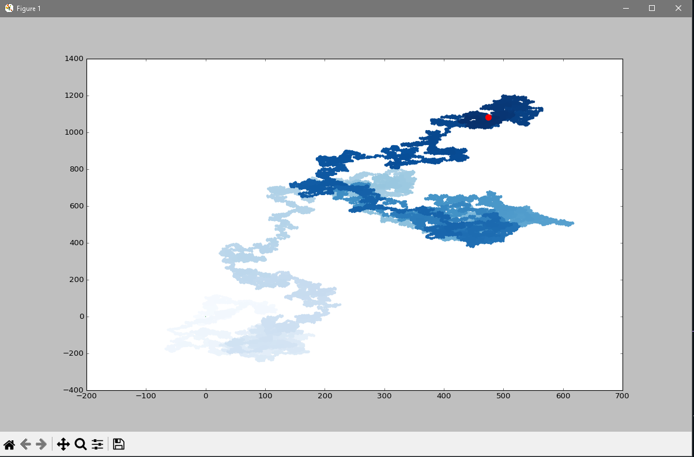

# Program That Generates a Random Walk and plots that walk on a scatter Plot graph.


 All Walks start from `0,0` on the grid and end at a random location based on the amount of points specified in the `RandomWalk` class. The default points number of points to generate the walk is `5000`.

 # Running the program
 To change the number of points to plot the walk change the default value of the `rw` instance in `rw_visual.py`.
 ```
 while True:
    rw = RandomWalk(5000)
    rw.fill_walk()
    ---snip---
```

## Now run the program
```
python rw_visual.py
```