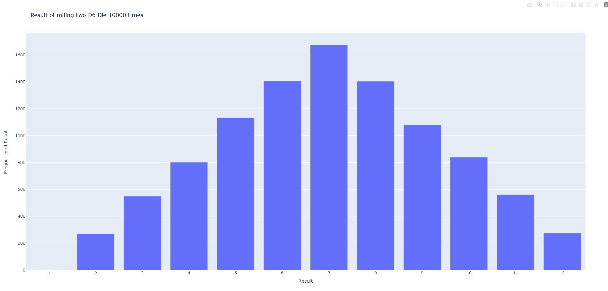

# Roll Die


Rolls two 6 sided Die and charts the frequency that each die is rolled. Die side may be changed by modifying the `die` initializer as so to create a 12 sided die:
```
die_3 = Die(12)
```

> Running `rw_visual.py` will roll the Die's and run the program offline creating `d6_d6.html`